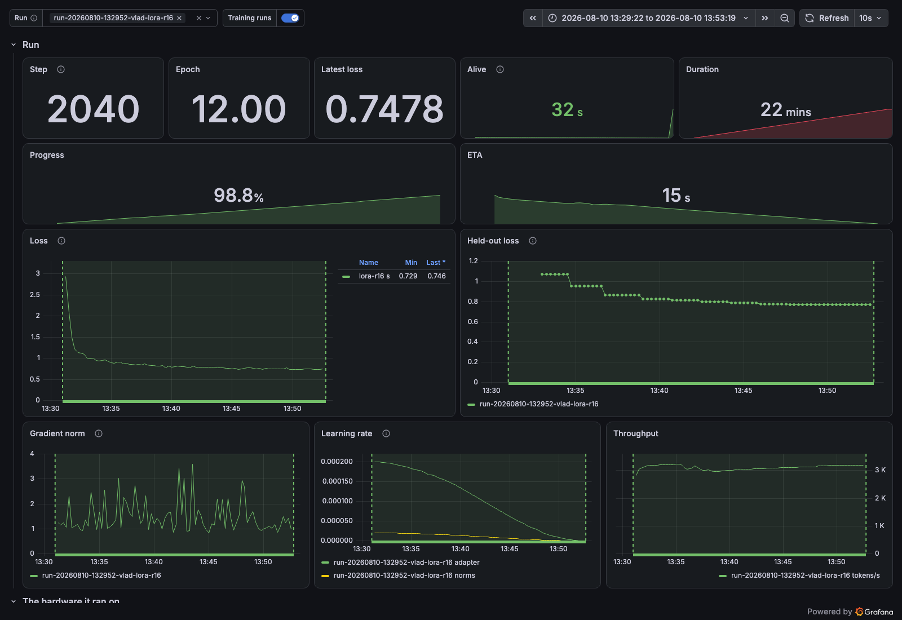

<h1 align="center">sparks</h1>

<p align="center">
  Training runs on your DGX Spark, with the curves next to the hardware they ran on.
</p>

---

Submit a training job from your laptop with one command. sparks builds your image, ships it to the
box, queues the run, and supervises it. Your loop reports its own loss and learning rate, and they
land in Grafana beside the GPU power and temperature from the same minutes.

## What it looks like

Every panel below is one run: a LoRA fine-tune of a 135M model, 2040 steps over twelve epochs. The
learning-rate panel carries two series because the adapter and the layer norms beneath it train an
order of magnitude apart.

<p align="center">
  
</p>

## Before you run it

sparks provisions nothing. It needs a box already set up by
[sparkup](https://github.com/vtemian/sparkup), which gives it Prometheus with the remote-write
receiver, Grafana, a plain-HTTP image registry, and the queue runner. sparkup writes
`/etc/sparks/box.toml` describing where all of that lives, and sparks refuses to start without it
rather than guessing.

On your own machine you need Docker, and SSH access to the box.

There are two halves. `sparks` is the client you run on a laptop. `fire` is the server, running as
the queue container's entrypoint on the box; you never invoke it yourself.

## Install

```sh
uv tool install git+https://github.com/vtemian/sparks
export SPARKS_HOST=you@your-box
sparks setup
```

`sparks setup` asks the box which registry it publishes and writes it into Docker's `daemon.json`,
because that registry is plain HTTP on your LAN. It prints a Docker restart command. Run it, and
know that a restart stops whatever containers you have. Skip this step and `docker push` fails,
which kills a submit before the job is even reserved.

That install form shells out to `git`. Without it, use the tarball, which is the same package:

```sh
uv tool install https://github.com/vtemian/sparks/archive/refs/heads/main.tar.gz
```

From a checkout, `make install` does both steps against the working tree you have.

## Your first job

[`examples/`](examples/) is a real LoRA fine-tune, and the run in the screenshot above:

```sh
sparks submit --context ./examples --data ./examples/data \
  --name lora-r16 -- python /app/lora_finetune.py --epochs 12
```

The client builds the image in `--context`, pushes it, uploads `--data`, and queues the job. That
folder arrives read-only at `/data`, also named by `$SPARKS_DATA`, so training code reads that path
and never a laptop one. `--image` skips the build and reuses a tag already in the registry.

Name your script by absolute path. The container's working directory is the box's shared directory,
not your image's, so a bare `python train.py` will not resolve.

## Instrumenting your loop

Wrap the loop, and report one step at a time:

```python
from sparks.emit import track

with track(total=epochs * len(loader), tokens_per_step=batch_size * BLOCK) as run:
    for batch in loader:
        loss = train_one(batch)
        run.step(loss=float(loss))
```

`run.step` derives `step`, `progress`, `eta_seconds`, `steps_per_sec` and `tokens_per_sec`; a value
you pass yourself wins over the derived one. Rates are measured over a sliding window of recent
steps, so the first step reports none. Leave out `total` or `tokens_per_step` and what they feed is
simply not emitted, never guessed. `epoch` is yours to pass; nothing derives it. `run.log(...)`
reports without advancing the step counter, which is what an `eval_loss` at the end of an epoch
wants.

Off the box, `track` yields a run that reports nothing, so the same script runs on your laptop with
no guard around it. It still checks your metric names there, so a typo fails locally rather than on
the box. Every push is wrapped, so a metrics outage can never kill a training run.

Metric names are a closed set declared in `sparks.metrics.METRICS`; `run.step(loss=…)` writes
`training_loss`, and a name that does not exist raises rather than vanishing. A metric no dashboard
can query is worse than an error.

## Watching a run

```sh
sparks queue            # what is running and waiting
sparks queue --all      # include finished jobs
sparks logs <job>       # the last 200 lines it printed; --all for every line
sparks status <job>     # one job in full: state, exit code, duration, energy
sparks wait <job>       # block until it ends; exit 0 only if it finished
sparks cancel <job>     # drop a job that has not started
sparks abort <job>      # stop one whether or not it has started
sparks retry <job>      # resubmit, reusing the image and data already there
sparks remove <job>     # delete a finished job
```

`<job>` is a full id, a unique fragment of one, or a job name. Ambiguity is refused rather than
guessed at. `queue` and `status` take `--json` for a script to read.

## Layout

```
src/sparks/     the client, the emitter, and fire (the queue server)
examples/       a runnable LoRA fine-tune and the image it needs
monitoring/     the Grafana dashboards and Prometheus alerts the box displays
skills/         Claude Code skills for writing a job and operating the queue
tests/          the suite, the house-rule checkers, and the on-box acceptance script
```

`ln -s "$PWD"/skills/* ~/.claude/skills/` installs the skills, if you drive this with Claude Code.

---

# Developing it

```sh
make check   # format, lint, mypy strict, tests, the house rules, dashboards
make live    # the same against a real Prometheus in Docker
```

`make check` needs no Docker and is what CI runs. `make live` is required for anything touching the
emitter's threading or the launch/supervise seam: no unit test can catch a second writer on a metric
series.

Which box the Makefile talks to lives in `local.mk`, untracked. Copy `local.mk.example` and edit it.
The Makefile exports `SPARKS_HOST`, so `make sparks ARGS="queue"` talks to the same box as
`make deploy`.

Dashboards and alerts in `monitoring/` are checked against the metrics this code actually emits, so
a panel querying something nothing produces fails here rather than showing an empty graph on the box.

## Getting a change onto the box

Three separate paths, depending on what you changed.

**The queue server (`fire`, and anything it imports)** ships as a container image. Push to `main`,
let CI build `ghcr.io/…/sparks:main`, then converge sparkup, which pulls the tag and recreates the
runner. `make deploy` does **not** update it, and until you converge, the box keeps running the old
one.

**The metrics library (`sparks.emit`)** is what `make deploy` is for: it installs the tree into
`SPARKS_VENV`, the venv your training project runs in. There is no default for that path and deploy
refuses without it, because it belongs to a project this one knows nothing about.

**Dashboards and alerts.** `make deploy` copies `monitoring/dashboards/` to the directory Grafana
watches; it rescans within ten seconds, no restart and no root. The alert rules are vendored into
sparkup and land with a converge.

---

MIT. See [LICENSE](LICENSE).
