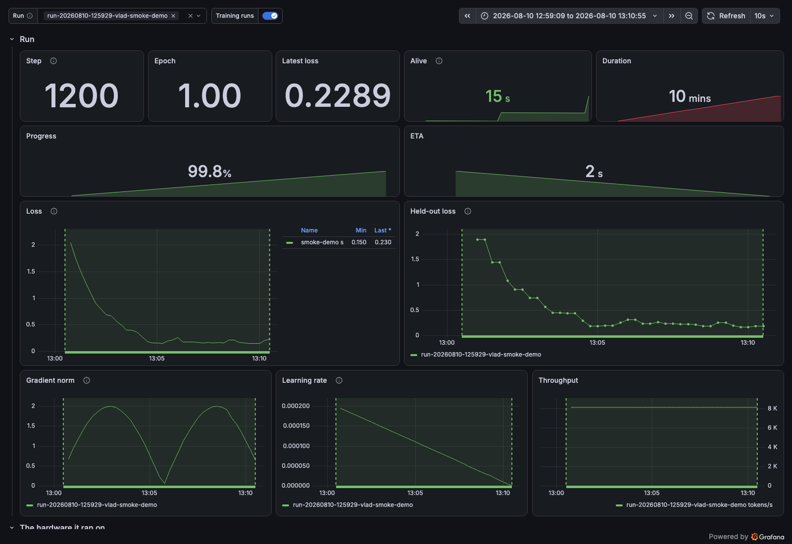
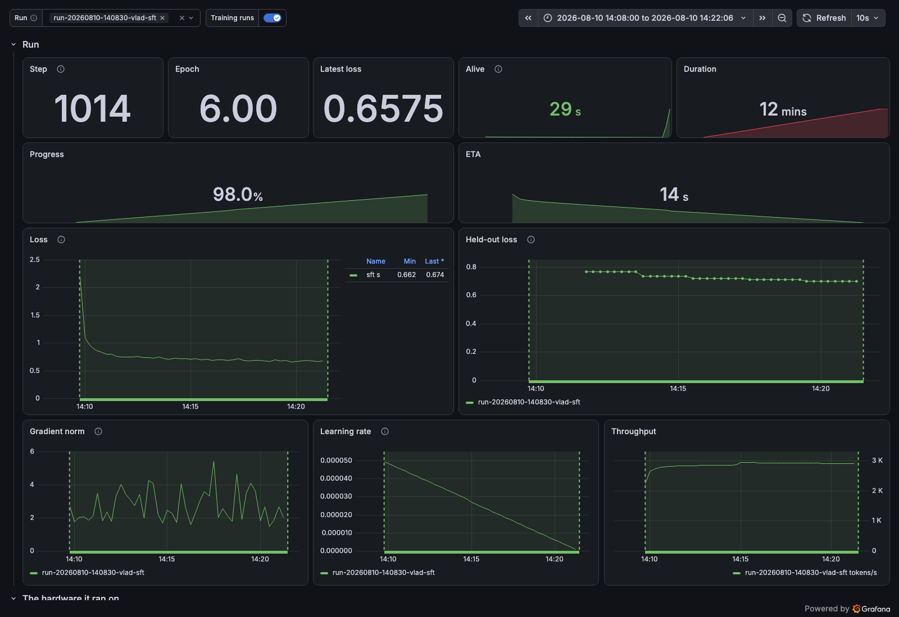

# Examples

Three runnable jobs, in the order worth running them.

## smoke_loop.py

A fake fine-tune with no GPU and no ML dependencies, so it proves the whole path — image pushed,
data mounted, run recorded, curves in Grafana — before you spend an hour finding out the last step
is broken.

```sh
sparks submit --context ./examples --data ./examples/data \
  --name smoke -- python /app/smoke_loop.py
```

That builds the `Dockerfile` here, which installs sparks and copies the scripts to `/app`. The
command names the script by absolute path because the container's working directory is the box's
shared directory, not the image's.

The default finishes in about fifteen seconds. Grafana floors its query step at the scrape
interval, so a run that short arrives as one averaged point rather than a curve; pass `--steps 1200
--step-seconds 0.5` for something to look at.



## finetune/

Two real fine-tunes of `SmolLM2-135M` against the corpus in `data/`. They share an image that
carries torch, transformers and peft, which is why they live in their own build context: it is
multi-gigabyte, and the smoke run should not need any of it.

`lora_finetune.py` is a hand-written loop with no `Trainer` — the shape sparks was built for. It
trains a LoRA adapter and the layer norms beneath it at learning rates an order of magnitude apart,
and reports them as two series through `log_group`, because one averaged series would describe
neither.

```sh
sparks submit --context ./examples/finetune --data ./examples/data \
  --name lora-r16 -- python /app/lora_finetune.py --epochs 3
```


`hf_trainer_callback.py` bridges `sparks.emit` to a HuggingFace `Trainer` in about twenty lines. It
maps Trainer's log keys to declared metric names explicitly, because those keys vary by version and
by task and an undeclared name raises.

```sh
sparks submit --context ./examples/finetune --data ./examples/data \
  --name sft -- python /app/hf_trainer_callback.py
```



## data/

A synthetic corpus, generated rather than collected, so the examples need no download and carry no
licence. Replace it with your own text; both fine-tunes read every `.txt` under `$SPARKS_DATA`.
